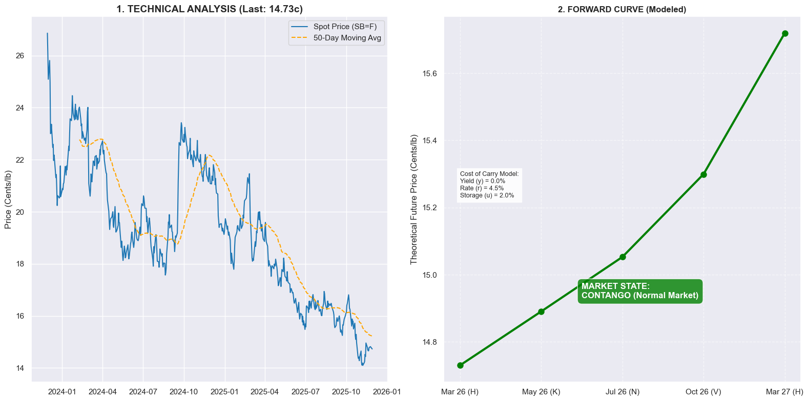

# Commodity-Forward-Curve-Python
Quantitative analysis of Sugar No.11 futures structure using Python and Cost of Carry model

# Why this project?
I built this tool to satisfy my curiosity about the mechanics of commodity markets. I wanted to move beyond Excel and use Python to visualize what's really happening in the Sugar market (SB=F).
This project was done for educational purposes: to practice my coding skills and apply the Cost of Carry theory to real-world data. 

---

## What am I analyzing? (Nov 2025)

The goal was simple: **Is the Sugar market in shortage (Backwardation) or oversupply (Contango)?**

# My Analysis of the Charts:

**1. The Crash (Left Chart)**
Looking at the trend, Sugar has been crashing hard. We dropped from 28 cents to **15.21 cents/lb**.
We are currently testing the production cost floor. Basically, sugar is cheap right now.

**2. The Structure (Right Chart)**
Since the price is low (15c), there is no panic in the market. There is plenty of sugar available.
* That's why my model shows a **Contango** curve (green line going up).
* The future price is higher than the spot price simply to cover the storage costs and interest rates.

---

# How the Code Works
I didn't just plot the data; I modeled the theoretical price using financial math.

I used the **Cost of Carry formula**:

$$F_t = S \cdot e^{(r + u - y)t}$$

* **Spot Price ($S$):** Retrieved live via Yahoo Finance.
* **Convenience Yield ($y$):** I set this to **0%** because there is no shortage right now.
* **The Result:** The math confirms that in a well-supplied market, the curve *must* go up.

---

# Tech Stack
* **Python** (Pandas, Numpy, Matplotlib) for the heavy lifting.
* **Yahoo Finance API** to fetch real market data.

---
*Created by Danilo Zekovik*
